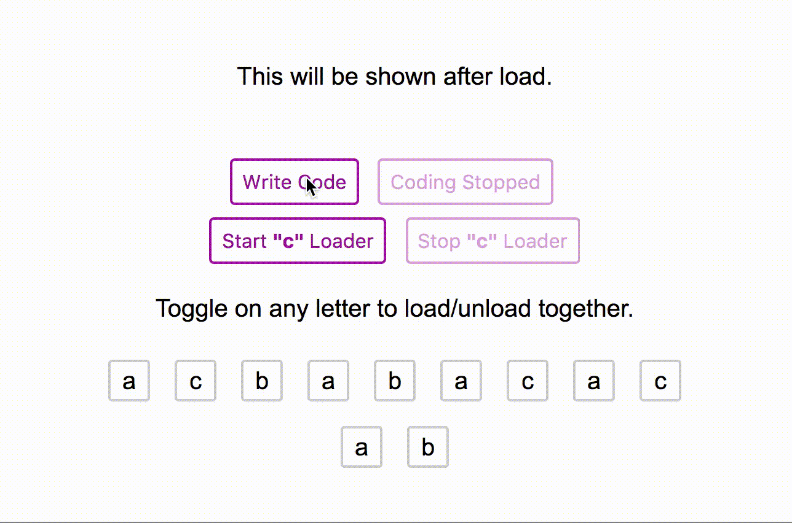

Multiple Process Loader Management for [Vue](http://vuejs.org/) and (optionally) [Vuex](http://vuex.vuejs.org/).

> Formerly known as **vuex-loading**



> [Play with demo above](https://f.github.io/vue-wait/).

**vue-wait** helps to manage multiple loading states on the page without any conflict. It's based on a **very simple idea** that manages an array (or Vuex store optionally) with multiple loading states. The **built-in loader component** listens its registered loader and immediately become loading state.

## 📦  Requirements

- [Vue.js](https://vuejs.org) (v2.0.0+)

## 🚀  Power Supplies
- [Vuex](http://vuex.vuejs.org), optionally (v2.0.0+)

## 🔧 Installation

```bash
$ yarn add vue-wait
# or if you using npm
$ npm install vue-wait
```

## 📖 Usage

```js
import VueWait from 'vue-wait'

Vue.use(VueWait) // add VueWait as Vue plugin
```

Then you should register `wait` property (`VueWait` instance) to the Vue instance:

```js
new Vue({
  el: '#app',
  store,
  wait: new VueWait({
    // Defaults values are following:
    useVuex: false,              // Uses Vuex to manage wait state
    vuexModuleName: 'wait',      // Vuex module name

    registerComponent: true,     // Registers `v-wait` component
    componentName: 'v-wait',     // <v-wait> component name, you can set `my-loader` etc.

    registerDirective: true,     // Registers `v-wait` directive
    directiveName: 'wait',       // <span v-wait /> directive name, you can set `my-loader` etc.

  }),
});
```

## ♻️ Usage with Vuex

Simply set `useVuex` parameter to `true` and optionally override
`vuexModuleName`

```js
import VueWait from 'vue-wait'

Vue.use(Vuex)
Vue.use(VueWait) // add VueWait as Vue plugin
```

Then you should register `VueWait` module:

```js
new Vue({
  el: '#app',
  store,
  wait: new VueWait({
    useVuex: true, // You must pass this option `true` to use Vuex
    vuexModuleName: 'vuex-example-module' // It's optional, `loading` by default.
  }),
});
```

Now `VueWait` will use `Vuex` store for data management which can be traced in `Vue DevTools > Vuex`

## ♻️ Usage with Nuxt.js

Add `vue-wait/nuxt` to modules section of `nuxt.config.js`

```js
{
  modules: [
    // Simple usage
    'vue-wait/nuxt'

    // Optionally passing options in module configuration
    ['vue-wait/nuxt', { useVuex: true }]
  ],

  // Optionally passing options in module top level configuration
  wait: { useVuex: true }
}
```

## 🔁 `VueWait` Options

You can use this options for customize VueWait behavior.

#### `accessorName`

`String` value, `$wait` by default, you can change this value to rename the accessor.

E.g. if you rename this to `$w`, your `VueWait` methods will be accessible by `$w.isWaiting(..)` etc.

#### `useVuex`

`Boolean` value, `false` by default, use this value for enabling
integration with `Vuex` store

When this value is true `VueWait` will store data in `Vuex` store
and all changes to this data will be made by dispatching actions to store

#### `vuexModuleName`

`String` value, `loading` by default.
Name for `Vuex` store if `useVuex` set to true, otherwise not used.

#### `registerComponent`

`Boolean` value, `true` by default, registers `v-wait` component.

#### `componentName`

`String` value, `v-wait` by default, changes `v-wait` component name.

#### `registerDirective`

`Boolean` value, `true` by default, registers `v-wait` directive.

#### `directiveName`

`String` value, `wait` by default, changes `v-wait` directive name.

## 🌈 Global Template Helpers

**vue-wait** provides some helpers to you to use in your templates.
All features can be obtained from $wait property in Vue components.

#### `.any`

Returns boolean value if any loader exists in page.

```html
<template>
  <progress-bar v-if="$wait.any">Please wait...</progress-bar>
</template>
```

#### `.isWaiting(loader String | Matcher)`

Returns boolean value if given loader exists in page.

```html
<template>
  <progress-bar v-if="$wait.isWaiting('creating user')">Creating User...</progress-bar>
</template>
```

Also you can use matcher to make it more flexible:

Please see [matcher](https://github.com/sindresorhus/matcher/) library to see how to use matchers.

```html
<template>
  <progress-bar v-if="$wait.isWaiting('creating.*')">Creating something...</progress-bar>
</template>
```

#### `.isWaiting(loaders Array<String>)`

Returns boolean value if some of given loaders exists in page.

```html
<template>
  <progress-bar v-if="$wait.isWaiting(['creating user', 'page loading'])">Creating User...</progress-bar>
</template>
```

#### `.start(loader String)`

Starts the given loader.

```html
<template>
  <button @click="$wait.start('creating user')">Create User</button>
</template>
```

#### `.end(loader String)`

Stops the given loader.

```html
<template>
  <button @click="$wait.end('creating user')">Cancel</button>
</template>
```

## 🏹 Directives

You can use directives to make your template cleaner.

#### `v-wait:visible='"loader name"'`

Shows if the given loader is loading.

```html
<template>
  <progress-bar v-wait:visible='"creating user"'>Creating User...</progress-bar>
</template>
```

#### `v-wait:hidden='"loader name"'` or `v-wait:visible.not='"loader name"'`

Hides if the given loader is loading.

```html
<template>
  <main v-wait:hidden='"creating *"'>Some Content</main>
</template>
```

#### `v-wait:disabled='"loader name"'`

Sets `disabled="disabled"` attribute to element if the given loader is loading.

```html
<template>
  <input v-wait:disabled="'*'" placeholder="Username" />
  <input v-wait:disabled="'*'" placeholder="Password" />
</template>
```

#### `v-wait:enabled='"loader name"'` or `v-wait:disabled.not='"loader name"'`

Removes `disabled="disabled"` attribute to element if the given loader is loading.

```html
<template>
  <button v-wait:enabled='"creating user"'>Abort Request</button>
</template>
```

#### `v-wait:click.start='"loader name"'`

Starts given loader on click.

```html
<template>
  <button v-wait:click.start='"create user"'>Start loader</button>
</template>
```

#### `v-wait:click.end='"loader name"'`

Ends given loader on click.

```html
<template>
  <button v-wait:click.end='"create user"'>End loader</button>
</template>
```

#### `v-wait:toggle='"loader name"'`

Toggles given loader on click.

```html
<template>
  <button v-wait:toggle='"flip flop"'>Toggles the loader</button>
</template>
```

## 🔌 Loading Action and Getter Mappers

**vue-wait** provides `mapWaitingActions` and `mapWaitingGetters` mapper to be used with your Vuex stores.

Let's assume you have a store and async **action**s called `createUser` and `updateUser`.
It will call the methods you map and will start loaders while action is resolved.

```js
import { mapWaitingActions, mapWaitingGetters } from 'vue-wait'

// ...
  methods: {
    ...mapWaitingActions('users', {
      getUsers: 'loading users',
      createUser: 'creating user',
      updateUser: 'updating user',
    }),
  },
  computed: {
    ...mapWaitingGetters({
      somethingWithUsers: [
        'loading users',
        'creating user',
        'updating user',
      ],
      deletingUser: 'deleting user',
    }),
  }
// ...

```

##### 😱 What happened to old `createActionHelpers`?

**We've removed them**. Since they were just calling `dispatch`, you can just write like following example. We don't like complexity.

```js
//...
actions: {
  async getUsers({ dispatch }) {
    const waiter = 'getting users';

    dispatch(`wait/start`, waiter, { root: true });
    await UserService.getUsers();
    dispatch(`wait/end`, waiter, { root: true });
  }
}
//...
```

**Using `mapWaitingActions` or `waitFor` instead is a better way.**

#### `waitFor(loader String, func Function, [,force_sync = false])`

Decorator that wraps function, will trigger a loading and will end loader after the original function (`func` argument) is finished.

By default `waitFor` return async function, if you want to wrap default sync function pass `true` in last argument

_Example using with async function_

```js
...
methods: {
  fetchDataFromApi: waitFor('fetch data', async function () {
    function sleep(ms) {
      return new Promise(resolve => setTimeout(resolve, ms));
    }
    // do work here
    await sleep(3000);
    // simulate some api call
    this.fetchResponse = Math.random()
  })
}
...
```

See also `examples/wrap-example`

## 💧 Using `v-wait` Component

If you disable `registerComponent` option then import and add `v-wait` into components

```js
import vLoading from 'vue-wait/src/components/v-wait.vue'
components: {
  'v-wait': vLoading
}
```

In template, you should wrap your content with `v-wait` component to show loading on it.

```html
<v-wait for='fetching data'>
  <template slot='waiting'>
    This will be shown when "fetching data" loader starts.
  </template>

  This will be shown when "fetching data" loader ends.
</v-wait>
```

Better example for a `button` with loading state:

```html
<button :disabled='$wait.isWaiting("creating user")'>
  <v-wait for='creating user'>
    <template slot='waiting'>Creating User...</template>
    Create User
  </v-wait>
</button>
```

## ⚡️ Making Reusable Loader Components

With reusable loader components, you will be able to use custom loader components as example below. This will allow you to create better **user loading experience**.


In this example above, the **tab gets data from back-end**, and the **table loads data from back-end at the same time**. With **vue-wait**, you will be able to manage these two seperated loading processes easily:

```html
<template lang='pug'>
div
  v-wait(for='fetching tabs')
    template(slot='waiting')
      b-tabs
        template(slot='tabs')
          b-nav-item(active disabled)
            v-icon(name='circle-o-notch', spin)
    b-tabs
      template(slot='tabs')
        b-nav-item(v-for='tab in tabs') {{ tab.name }}

  v-wait(for='fetching data')
    table-gradient-spinner(slot='waiting')
    table
      tr(v-for='row in data')
        // ...
</template>
```

You may want to design your own reusable loader for your project. You better create a wrapper component called `my-waiter`:

```html
<!-- MySpinner.vue -->
<i18n>
  tr:
    loading: Yükleniyor...
  en:
    loading: Loading...
</i18n>

<template lang="pug">
  div.loading-spinner
    //- Uses vue-awesome spinner
    v-icon(name='refresh', spin)
    span {{ $t('loading') }}
</template>

<style scoped lang="scss">
  .loading-spinner {
    opacity: 0.5;
    margin: 50px auto;
    text-align: center;
    .fa-icon {
      vertical-align: middle;
      margin-right: 10px;
    }
  }
</style>
```

Now you can use your spinner everywhere using `slot='waiting'` attribute:

```html
<template lang="pug">
  v-wait(for='fetching data')
    my-waiter(slot='waiting')
    div
      p My main content after fetching data...
</template>
```

## 🚌 Run example

Use `npm run dev-vuex`, `npm run dev-vue` or `npm run dev-wrap` commands.
for running examples locally.

## 🎯 Contributors

- Fatih Kadir Akın, (creator)
- Igor, (maintainer, made Vuex-free)

## 🔑 License

MIT © [Fatih Kadir Akın](https://github.com/f)
