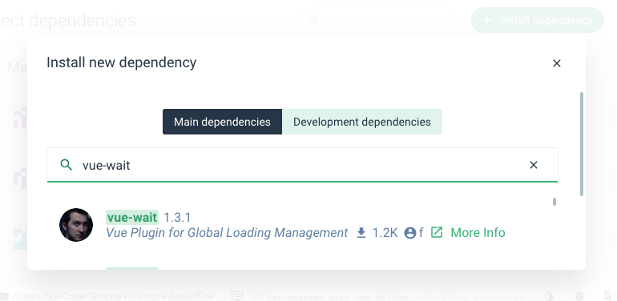
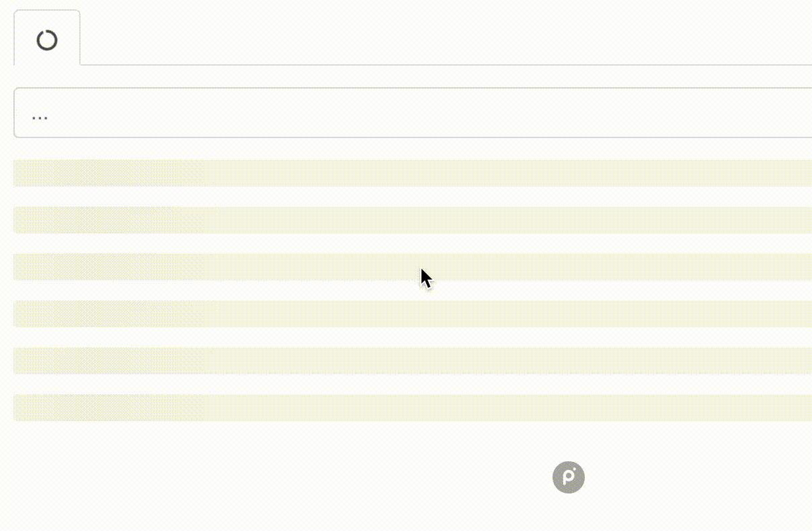

<p align="center">

</p>
<p align="center">
 Multiple Process Loader Management for <a href="http://vuejs.org/" rel="nofollow" class="rich-diff-level-one">Vue</a> and (optionally) <a href="http://vuex.vuejs.org/" rel="nofollow" class="rich-diff-level-one">Vuex</a>.
</p>

<p align="center">
 <strong class="rich-diff-level-one">Read the <a href="https://medium.com/@fkadev/managing-complex-waiting-experiences-on-web-uis-29534d2d92a8" rel="nofollow">Medium post "Managing Complex Waiting Experiences on Web UIs"</a>.</strong>
</p>

[](https://badge.fury.io/js/vue-wait)

---


> [Play with demo above](https://f.github.io/vue-wait/).

**vue-wait** helps to manage multiple loading states on the page without any conflict. It's based on a **very simple idea** that manages an array (or Vuex store optionally) with multiple loading states. The **built-in loader component** listens its registered loader and immediately become loading state.

# ⏩Quick Start

If you are a **try and learn** developer, you can start trying the **vue-wait** now using [codesandbox.io](https://codesandbox.io).

[](https://codesandbox.io/s/85q3vpm42?autoresize=1&hidenavigation=1&module=%2Fsrc%2Fcomponents%2FMyList.vue)

### 1. Install:
```bash
yarn add vue-wait
```
 
### 2. Require:
```js
import VueWait from 'vue-wait'

Vue.use(VueWait)

new Vue({
  // your vue config
  wait: new VueWait(),
})
```

### 3. Use in Your Components

```vue
<template>
  <v-wait for="my list is to load">
    <template slot="waiting">
      <div>
        
        Loading the list...
      </div>
    </template>
    <ul>
      <li v-for="item in myList">{{ item }}</li>
    </ul>
  </v-wait>
</template>

<script>
  export default {
    data() {
      return {
        myList: []
      }
    },
    async created() {
      // start waiting
      this.$wait.start('my list is to load');
      
      this.myList = await fetch('/my-list-url');
      
      // stop waiting
      this.$wait.end('my list is to load');
    },
  };
</script>
```

> **vue-wait has more abilities to make the management easier, please read the complete documentation.**

# ▶️Detailed Start

## 📦  Requirements

- [Vue.js](https://vuejs.org) (v2.0.0+)

## 🚀  Power Supplies
- [Vuex](http://vuex.vuejs.org), optionally (v2.0.0+)

## 🔧 Installation

via CLI:

```bash
$ yarn add vue-wait
# or if you using npm
$ npm install vue-wait
```

via Vue UI:



## 📖 Usage

```js
import VueWait from 'vue-wait'

Vue.use(VueWait) // add VueWait as Vue plugin
```

Then you should register `wait` property (`VueWait` instance) to the Vue instance:

```js
new Vue({
  el: '#app',
  store,
  wait: new VueWait({
    // Defaults values are following:
    useVuex: false,              // Uses Vuex to manage wait state
    vuexModuleName: 'wait',      // Vuex module name

    registerComponent: true,     // Registers `v-wait` component
    componentName: 'v-wait',     // <v-wait> component name, you can set `my-loader` etc.

    registerDirective: true,     // Registers `v-wait` directive
    directiveName: 'wait',       // <span v-wait /> directive name, you can set `my-loader` etc.

  }),
});
```

## ♻️ Usage with Vuex

Simply set `useVuex` parameter to `true` and optionally override
`vuexModuleName`

```js
import VueWait from 'vue-wait'

Vue.use(Vuex)
Vue.use(VueWait) // add VueWait as Vue plugin
```

Then you should register `VueWait` module:

```js
new Vue({
  el: '#app',
  store,
  wait: new VueWait({
    useVuex: true, // You must pass this option `true` to use Vuex
    vuexModuleName: 'vuex-example-module' // It's optional, `wait` by default.
  }),
});
```

Now `VueWait` will use `Vuex` store for data management which can be traced in `Vue DevTools > Vuex`

## ♻️ Usage with Nuxt.js

Add `vue-wait/nuxt` to modules section of `nuxt.config.js`

```js
{
  modules: [
    // Simple usage
    'vue-wait/nuxt'

    // Optionally passing options in module configuration
    ['vue-wait/nuxt', { useVuex: true }]
  ],

  // Optionally passing options in module top level configuration
  wait: { useVuex: true }
}
```

## 🔁 `VueWait` Options

You can use this options for customize VueWait behavior.

| Option Name | Type | Default | Description |
| ----------- | ---- | ------- | ----------- |
| `accessorName` | `String` | `"$wait"` | You can change this value to rename the accessor. E.g. if you rename this to `$w`, your `VueWait` methods will be accessible by `$w.waits(..)` etc. |
| `useVuex` | `Boolean` | `false` | Use this value for enabling integration with `Vuex` store. When this value is true `VueWait` will store data in `Vuex` store and all changes to this data will be made by dispatching actions to store |
| `vuexModuleName` | `String` | `"wait"` | Name for `Vuex` store if `useVuex` set to true, otherwise not used. |
| `registerComponent` | `Boolean` | `true` | Registers `v-wait` component. |
| `componentName` | `String` | `"v-wait"` | Changes `v-wait` component name. |
| `registerDirective` | `Boolean` | `true` | Registers `v-wait` directive. |
| `directiveName` | `String` | `"v-wait"` | Changes `v-wait` directive name. |

## 🌈 Global Template Helpers

**vue-wait** provides some helpers to you to use in your templates.
All features can be obtained from $wait property in Vue components.

#### `.any`

Returns boolean value if any loader exists in page.

```vue
<template>
  <progress-bar v-if="$wait.any">Please wait...</progress-bar>
</template>
```

#### `.is(loader String | Matcher)` or `.waiting(loader String | Matcher)`

Returns boolean value if given loader exists in page.

```vue
<template>
  <progress-bar v-if="$wait.is('creating user')">Creating User...</progress-bar>
</template>
```

You can use **`waiting`** alias instead of **`is`**.

```vue
<template>
  <div v-if="$wait.waiting('fetching users')">
    Fetching users...
  </div>
</template>
```

Also you can use matcher to make it more flexible:

Please see [matcher](https://github.com/sindresorhus/matcher/) library to see how to use matchers.

```vue
<template>
  <progress-bar v-if="$wait.is('creating.*')">Creating something...</progress-bar>
</template>
```

#### `.is(loaders Array<String | Matcher>)` or `.waiting(loaders Array<String | Matcher>)`

Returns boolean value if some of given loaders exists in page.

```vue
<template>
  <progress-bar v-if="$wait.is(['creating user', 'page loading'])">Creating User...</progress-bar>
</template>
```

#### `.start(loader String)`

Starts the given loader.

```vue
<template>
  <button @click="$wait.start('creating user')">Create User</button>
</template>
```

#### `.end(loader String)`

Stops the given loader.

```vue
<template>
  <button @click="$wait.end('creating user')">Cancel</button>
</template>
```

#### `.progress(loader String, current [, total = 100])`

Sets the progress of the given loader.

```vue
<template>
  <progress min="0" max="100" :value="$wait.percent('downloading')" />
  <button @click="$wait.progress('downloading', 10)">Set progress to 10</button>
  <button @click="$wait.progress('downloading', 50)">Set progress to 50</button>
  <button @click="$wait.progress('downloading', 50, 200)">Set progress to 50 of 200 (25%)</button>
</template>
```

##### Completing the Progress

To complete the progress, `current` value should be set bigger than `100`.
If you `total` is given, `current` must be bigger than `total`.

```vue
<button @click="$wait.progress('downloading', 101)">Set as downloaded (101 of 100)</button>
```

or

```vue
<button @click="$wait.progress('downloading', 5, 6)">Set as downloaded (6 of 5)</button>
```

#### `.percent(loader String)`

Returns the percentage of the given loader.

```vue
<template>
  <progress min="0" max="100" :value="$wait.percent('downloading')" />
</template>
```

## 🏹 Directives

You can use directives to make your template cleaner.

#### `v-wait:visible='"loader name"'`

Shows if the given loader is loading.

```vue
<template>
  <progress-bar v-wait:visible='"creating user"'>Creating User...</progress-bar>
</template>
```

#### `v-wait:hidden='"loader name"'` or `v-wait:visible.not='"loader name"'`

Hides if the given loader is loading.

```vue
<template>
  <main v-wait:hidden='"creating *"'>Some Content</main>
</template>
```

#### `v-wait:disabled='"loader name"'`

Sets `disabled="disabled"` attribute to element if the given loader is loading.

```vue
<template>
  <input v-wait:disabled="'*'" placeholder="Username" />
  <input v-wait:disabled="'*'" placeholder="Password" />
</template>
```

#### `v-wait:enabled='"loader name"'` or `v-wait:disabled.not='"loader name"'`

Removes `disabled="disabled"` attribute to element if the given loader is loading.

```vue
<template>
  <button v-wait:enabled='"creating user"'>Abort Request</button>
</template>
```

#### `v-wait:click.start='"loader name"'`

Starts given loader on click.

```vue
<template>
  <button v-wait:click.start='"create user"'>Start loader</button>
</template>
```

#### `v-wait:click.end='"loader name"'`

Ends given loader on click.

```vue
<template>
  <button v-wait:click.end='"create user"'>End loader</button>
</template>
```

#### `v-wait:toggle='"loader name"'`

Toggles given loader on click.

```vue
<template>
  <button v-wait:toggle='"flip flop"'>Toggles the loader</button>
</template>
```

#### `v-wait:click.progress='["loader name", 80]'`

Sets the progress of given loader on click.

```vue
<template>
  <button v-wait:click.progress='["downloading", 80]'>Set the "downloading" loader to 80</button>
</template>
```

## 🔌 Loading Action and Getter Mappers

**vue-wait** provides `mapWaitingActions` and `mapWaitingGetters` mapper to be used with your Vuex stores.

Let's assume you have a store and async **action**s called `createUser` and `updateUser`.
It will call the methods you map and will start loaders while action is resolved.

```js
import { mapWaitingActions, mapWaitingGetters } from 'vue-wait'

// ...
  methods: {
    ...mapWaitingActions('users', {
      getUsers: 'loading users',
      createUser: 'creating user',
      updateUser: 'updating user',
    }),
  },
  computed: {
    ...mapWaitingGetters({
      somethingWithUsers: [
        'loading users',
        'creating user',
        'updating user',
      ],
      deletingUser: 'deleting user',
    }),
  }
// ...
```

You can also map **action** to custom method and customize loader name like in example below:

```js
import { mapWaitingActions, mapWaitingGetters } from 'vue-wait'

// ...
  methods: {
    ...mapWaitingActions('users', {
      getUsers: { action: 'getUsers', loader: 'loading users' },
      createUser: { action: 'createUser', loader: 'creating user'},
      createSuperUser: { action: 'createUser', loader: 'creating super user' },
    }),
  }, 
// ...
```

There is also possibility to use array as a second argument to mapWaitingActions:
```js
// ...
  methods: {
    ...mapWaitingActions('users', [
      'getUsers',
      { method: 'createUser', action: 'createUser', loader: 'creating user'},
      { method: 'createSuperUser', action: 'createUser', loader: 'creating super user' },
    ]),
  }, 
// ...


```

### ☢️Advanced Getters and Actions Usage

> The Vuex module name is `wait` by default. If you've changed on config, you should get it by `rootGetters['<vuex module name>/is']` or `rootGetters['<vuex module name>/any']`.

You can access `vue-wait`'s Vuex getters using `rootGetters` in Vuex.

```js
getters: {
  cartOperationInProgress(state, getters, rootState, rootGetters) {
    return rootGetters['wait/is']('cart.*');
  }
},
```

And you can start and end loaders using `wait` actions. You must pass `root: true` option to the `dispatch` method.

```js
actions: {
  async addItemToCart({ dispatch }, item) {
    dispatch('wait/start', 'cart.addItem', { root: true });
    await CartService.addItem(item);
    dispatch('wait/end', 'cart.addItem', { root: true });
  }
},
```

#### `waitFor(loader String, func Function [,forceSync = false])`

Decorator that wraps function, will trigger a loading and will end loader after the original function (`func` argument) is finished.

By default `waitFor` return async function, if you want to wrap default sync function pass `true` in last argument

_Example using with async function_

```js
import { waitFor } from 'vue-wait';

...
methods: {
  fetchDataFromApi: waitFor('fetch data', async function () {
    function sleep(ms) {
      return new Promise(resolve => setTimeout(resolve, ms));
    }
    // do work here
    await sleep(3000);
    // simulate some api call
    this.fetchResponse = Math.random()
  })
}
...
```

See also `examples/wrap-example`

## 💧 Using `v-wait` Component

If you disable `registerComponent` option then import and add `v-wait` into components

```js
import vLoading from 'vue-wait/src/components/v-wait.vue'
components: {
  'v-wait': vLoading
}
```

In template, you should wrap your content with `v-wait` component to show loading on it.

```vue
<v-wait for='fetching data'>
  <template slot='waiting'>
    This will be shown when "fetching data" loader starts.
  </template>

  This will be shown when "fetching data" loader ends.
</v-wait>
```

Better example for a `button` with loading state:

```vue
<button :disabled='$wait.is("creating user")'>
  <v-wait for='creating user'>
    <template slot='waiting'>Creating User...</template>
    Create User
  </v-wait>
</button>
```

## ⚡️ Making Reusable Loader Components

With reusable loader components, you will be able to use custom loader components as example below. This will allow you to create better **user loading experience**.



In this example above, the **tab gets data from back-end**, and the **table loads data from back-end at the same time**. With **vue-wait**, you will be able to manage these two seperated loading processes easily:

```vue
<template lang='pug'>
  <div>
    <v-wait for="fetching tabs">
      <template slot="waiting">
        <b-tabs>
          <template slot="tabs">
            <b-nav-item active="active" disabled>
              <v-icon name="circle-o-notch" spin="spin" />
            </b-nav-item>
          </template>
        </b-tabs>
      </template>
      <b-tabs>
        <template slot="tabs">
          <b-nav-item v-for="tab in tabs">{{ tab.name }}</b-nav-item>
        </template>
      </b-tabs>
    </v-wait>
    <v-wait for="fetching data">
      <table-gradient-spinner slot="waiting" />
      <table>
        <tr v-for="row in data">
          <!-- ...-->
        </tr>
      </table>
    </v-wait>
  </div>
</template>
```

You may want to design your own reusable loader for your project. You better create a wrapper component called `my-waiter`:

```vue
<!-- MySpinner.vue -->
<i18n>
  tr:
    loading: Yükleniyor...
  en:
    loading: Loading...
</i18n>

<template>
  <div class="loading-spinner">
    <v-icon name="refresh" spin="spin" />
    <span>{{ $t('loading') }}</span>
  </div>
</template>

<style scoped lang="scss">
  .loading-spinner {
    opacity: 0.5;
    margin: 50px auto;
    text-align: center;
    .fa-icon {
      vertical-align: middle;
      margin-right: 10px;
    }
  }
</style>
```

Now you can use your spinner everywhere using `slot='waiting'` attribute:

```vue
<template lang="pug">
  <v-wait for="fetching data">
    <my-waiter slot="waiting" />
    <div>
      <p>My main content after fetching data...</p>
    </div>
  </v-wait>
</template>
```

## 📦 Using with external spinner libraries

You can use `vue-wait` with another spinner libraries like [epic-spinners](https://github.com/epicmaxco/epic-spinners) or other libraries. You just need to add `slot="waiting"` to the component and Vue handles rest of the work.

First register the component,
```js
import { OrbitSpinner } from 'epic-spinners';
Vue.component('orbit-spinner', OrbitSpinner);
```

Then use it in your as a `v-wait`'s `waiting` slot.
```vue
<v-wait for='something to load'>
  <orbit-spinner
    slot='waiting'
    :animation-duration="1500"
    :size="64"
    :color="'#ff1d5e'"
  />
</v-wait>
```

... and done!

For other libraries you can use, please see [Loaders section of **vuejs/awesome-vue**](https://github.com/vuejs/awesome-vue#loader).

## 🚌 Run example

Use `npm run dev-vuex`, `npm run dev-vue` or `npm run dev-wrap` commands.
for running examples locally.

## ✔ Testing components

You can test components using `vue-wait` but it requires configuration. Let's take a basic component for instance:

```vue
<v-wait for="loading">
   <Spinner slot="waiting" />
   <ul class="suggestions">
      <li v-for="suggestion in suggestions">{{ suggestion.Name }}</li>
   </ul>
</v-wait>
```

```js
const localVue = createLocalVue();
localVue.use(Vuex); // optionally when you use Vuex integration

it('uses vue-wait component', () => {
    const wrapper = shallowMount(Suggestions, { localVue });
    expect(wrapper.find('.suggestions').exists()).toBe(true);
});
```

`vue-test-utils` will replace `v-wait` component with an empty `div`, making it difficult to test correctly.

First, make your local Vue instance use `vue-wait`,

```js
const localVue = createLocalVue();
localVue.use(Vuex); // optionally when you use Vuex integration
localVue.use(VueWait);
```

Then inject the `wait` property using `VueWait` constructor,

```js
it('uses vue-wait component', () => {
    const wrapper = shallowMount(SuggestedAddresses, {
      localVue,
      wait: new VueWait()
    });
    expect(wrapper.find('.suggestions').exists()).toBe(true); // it works!
});
```

## 🎯 Contributors

 - Fatih Kadir Akın, (creator)
 - Igor, (maintainer, made Vuex-free)

## 🔗 Other Implementations

Since **vue-wait** based on a very simple idea, it can be implemented on other frameworks.

 - [react-wait](https://github.com/f/react-wait): Multiple Process Loader Management for React.
 - [dom-wait](https://github.com/f/dom-wait): Multiple Process Loader Management for vanilla JavaScript.

## 🔑 License

MIT © [Fatih Kadir Akın](https://github.com/f)
